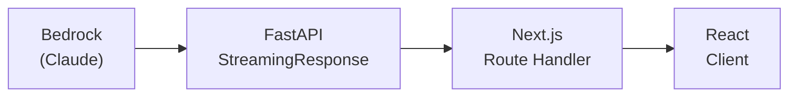

# エンドツーエンド SSE ストリーミング実装仕様

## 概要

ユーザーのメッセージに対し、AI の応答を **Server-Sent Events (SSE)** でリアルタイムにストリーミングします。以下の 3 レイヤーを通じてトークンが流れます。



## SSE フォーマット仕様

各チャンクは RFC 8898 に準拠した SSE フォーマットで送信します。

```
data: {"type":"token","content":"こんにち"}\n\n
data: {"type":"token","content":"は！"}\n\n
data: {"type":"done","session_id":"abc123"}\n\n
```

### イベントタイプ

| type | 説明 | payload |
|------|------|---------|
| `token` | LLM からのテキストトークン | `{ content: string }` |
| `tool_start` | ツール実行開始 | `{ tool_name: string }` |
| `tool_end` | ツール実行完了 | `{ tool_name: string, result: string }` |
| `done` | ストリーム完了 | `{ session_id: string }` |
| `error` | エラー発生 | `{ message: string, code: string }` |

## FastAPI 側の実装

### ストリーミングエンドポイント

```python
# app/api/chat.py
from fastapi import FastAPI
from fastapi.responses import StreamingResponse
from langchain_aws import ChatBedrock
from langgraph.graph import StateGraph
import json

app = FastAPI()


async def stream_agent_response(user_message: str, session_id: str):
    """LangGraph エージェントの応答を SSE 形式でストリームする Generator"""

    llm = ChatBedrock(
        model_id="anthropic.claude-haiku-3-5-v1:0",
        streaming=True,
        model_kwargs={"max_tokens": 4096},
    )

    config = {"configurable": {"thread_id": session_id}}

    async for event in agent.astream_events(
        {"messages": [("human", user_message)]},
        config=config,
        version="v2",
    ):
        kind = event["event"]

        # LLM のトークンストリーム
        if kind == "on_chat_model_stream":
            chunk = event["data"]["chunk"]
            if chunk.content:
                yield f"data: {json.dumps({'type': 'token', 'content': chunk.content})}\n\n"

        # ツール実行開始
        elif kind == "on_tool_start":
            yield f"data: {json.dumps({'type': 'tool_start', 'tool_name': event['name']})}\n\n"

        # ツール実行完了
        elif kind == "on_tool_end":
            yield f"data: {json.dumps({'type': 'tool_end', 'tool_name': event['name']})}\n\n"

    # 完了通知
    yield f"data: {json.dumps({'type': 'done', 'session_id': session_id})}\n\n"


@app.post("/chat")
async def chat(request: ChatRequest):
    return StreamingResponse(
        stream_agent_response(request.message, request.session_id),
        media_type="text/event-stream",
        headers={
            "Cache-Control": "no-cache",
            "X-Accel-Buffering": "no",  # Nginx のバッファリング無効化
        },
    )
```

### エラーハンドリング

```python
async def stream_agent_response(user_message: str, session_id: str):
    try:
        async for event in agent.astream_events(...):
            # ... 通常処理 ...
    except Exception as e:
        # エラーも SSE で返す（接続を維持したままクライアントに通知）
        yield f"data: {json.dumps({'type': 'error', 'message': str(e), 'code': 'AGENT_ERROR'})}\n\n"
    finally:
        yield f"data: {json.dumps({'type': 'done', 'session_id': session_id})}\n\n"
```

## Next.js BFF 側の実装（Route Handler）

### SSE 中継ハンドラー

```typescript
// src/app/api/chat/route.ts
import { NextRequest } from "next/server";

export const runtime = "edge"; // Edge Runtime で低レイテンシ中継

export async function POST(req: NextRequest) {
  const body = await req.json();

  // Python バックエンドへ転送
  const pythonResponse = await fetch(
    `${process.env.PYTHON_API_URL}/chat`,
    {
      method: "POST",
      headers: { "Content-Type": "application/json" },
      body: JSON.stringify(body),
    }
  );

  if (!pythonResponse.ok) {
    return new Response("Backend error", { status: pythonResponse.status });
  }

  // ReadableStream でそのままクライアントへパイプ
  return new Response(pythonResponse.body, {
    headers: {
      "Content-Type": "text/event-stream",
      "Cache-Control": "no-cache",
      Connection: "keep-alive",
    },
  });
}
```

### 認証トークン付与（BFF パターン）

```typescript
// src/app/api/chat/route.ts（認証付き版）
export async function POST(req: NextRequest) {
  // セッションから認証情報を取得（NextAuth.js 等を想定）
  const session = await getServerSession();
  if (!session) {
    return new Response("Unauthorized", { status: 401 });
  }

  const pythonResponse = await fetch(`${process.env.PYTHON_API_URL}/chat`, {
    method: "POST",
    headers: {
      "Content-Type": "application/json",
      // 内部サービス間認証トークン（クライアントには非公開）
      Authorization: `Bearer ${process.env.INTERNAL_API_KEY}`,
    },
    body: JSON.stringify({ ...body, user_id: session.user.id }),
  });

  return new Response(pythonResponse.body, {
    headers: { "Content-Type": "text/event-stream", "Cache-Control": "no-cache" },
  });
}
```

## フロントエンド側の実装

### SSE 受信と状態更新

```typescript
// src/hooks/useChat.ts
export function useChat() {
  const [messages, setMessages] = useState<Message[]>([]);
  const [isStreaming, setIsStreaming] = useState(false);

  async function sendMessage(userInput: string, sessionId: string) {
    setIsStreaming(true);

    // ユーザーメッセージを即座に追加
    setMessages((prev) => [...prev, { role: "user", content: userInput }]);

    // ストリーミング中の AI メッセージプレースホルダー
    const streamMsgId = Date.now();
    setMessages((prev) => [...prev, { id: streamMsgId, role: "ai", content: "" }]);

    const response = await fetch("/api/chat", {
      method: "POST",
      headers: { "Content-Type": "application/json" },
      body: JSON.stringify({ message: userInput, session_id: sessionId }),
    });

    const reader = response.body!.getReader();
    const decoder = new TextDecoder();

    while (true) {
      const { done, value } = await reader.read();
      if (done) break;

      const lines = decoder.decode(value).split("\n\n").filter(Boolean);
      for (const line of lines) {
        if (!line.startsWith("data: ")) continue;

        const event = JSON.parse(line.slice(6));

        if (event.type === "token") {
          // ストリーミングテキストをリアルタイム追記
          setMessages((prev) =>
            prev.map((m) =>
              m.id === streamMsgId ? { ...m, content: m.content + event.content } : m
            )
          );
        } else if (event.type === "done") {
          setIsStreaming(false);
        } else if (event.type === "error") {
          console.error("Stream error:", event.message);
          setIsStreaming(false);
        }
      }
    }
  }

  return { messages, sendMessage, isStreaming };
}
```

## タイムアウトとリトライ戦略

| ケース | 対処 |
|------|------|
| Lambda コールドスタート | Lambda SnapStart または Provisioned Concurrency |
| ネットワーク切断 | `EventSource` の自動再接続 or カスタム再接続ロジック |
| Bedrock スロットリング | `ThrottlingException` を catch し、指数バックオフでリトライ |
| 30秒タイムアウト | API Gateway のタイムアウトは 29秒。LWA + Lambda で回避不要（Function URL 使用時） |

## 関連ドキュメント

- [システム全体構成](../architecture/overall.md)
- [AWS リソース設計](../infrastructure/aws-resources.md)
- [UI 設計](../frontend/ui-design.md)
