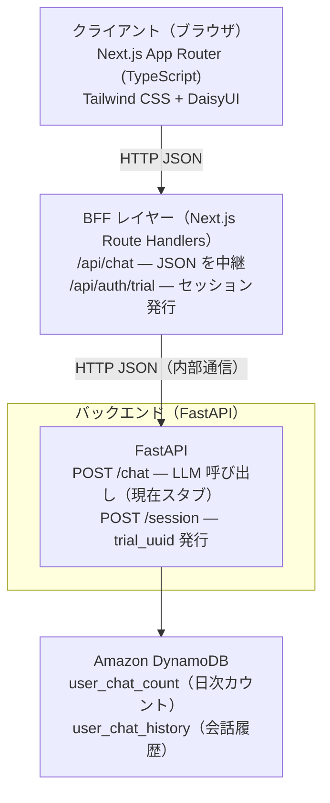

# システム全体構成

## アーキテクチャ概要

本アプリは **Next.js BFF（Backend for Frontend）** と **Python FastAPI バックエンド** を組み合わせた構成です。現在はローカル開発環境で動作しており、AWS へのデプロイは今後実施予定です。

## 構成図



## データフロー

### 1. セッション開始

```
1. ユーザーが初回アクセス
2. Next.js クライアント: POST /api/auth/trial
3. Route Handler: Python API POST /session へ転送
4. FastAPI: trial_uuid を生成し HTTPOnly Cookie にセット
5. 以降のリクエストは trial_uuid で識別
```

### 2. チャットリクエスト

```
1. ユーザーがメッセージ送信
2. Next.js クライアント: POST /api/chat
3. Route Handler: Python API POST /chat へ JSON 転送（Cookie 付き）
4. FastAPI: 日次チャット上限チェック → 会話履歴取得 → LLM 呼び出し
5. レスポンス: JSON で返却 { reply, chat_count, chat_limit }
6. フロントエンド: DaisyUI chat-bubble にメッセージを表示
```

### 3. チャット制限

```
1. 1日あたりの送信上限（デフォルト: 5回）を DynamoDB で管理
2. 上限到達時は 403 を返却
3. カウントは JST 日付ベースでリセット（TTL による自動削除）
```

## 現在の実装状況

| 機能 | 状態 | 備考 |
|------|------|------|
| セッション管理（trial_uuid） | 実装済み | HTTPOnly Cookie |
| チャット回数制限 | 実装済み | DynamoDB + JST 日次リセット |
| 会話履歴保存 | 実装済み | DynamoDB |
| LLM 統合 | **未実装（スタブ）** | LangChain + Bedrock で実装予定 |
| SSE ストリーミング | **未実装** | 現在は JSON ポーリング |
| RAG（S3 Vectors） | **未実装** | 設計は [future/rag-pipeline.md](../future/rag-pipeline.md) を参照 |
| AWS デプロイ | **未実装** | CDK でスタック定義中 |

## デプロイ構成（予定）

| コンポーネント | ホスティング | 理由 |
|-------------|------------|------|
| Next.js フロントエンド | 未定（Vercel / AWS Amplify 等） | — |
| FastAPI バックエンド | AWS Lambda (LWA) 予定 | リクエスト課金、常時起動不要 |
| DynamoDB | AWS フルマネージド | 自動スケール、サーバーレス親和 |

## 関連ドキュメント

- [SSE ストリーミング仕様（将来設計）](../future/streaming-spec.md)
- [RAG パイプライン設計（将来設計）](../future/rag-pipeline.md)
- [AWS リソース設計](https://github.com/ktr11/profile-chat-ai-infra/blob/main/docs/aws-resources.md)（infra リポ）
- [UI 設計](https://github.com/ktr11/profile-chat-ai-fe/blob/main/docs/ui-design.md)（fe リポ）
