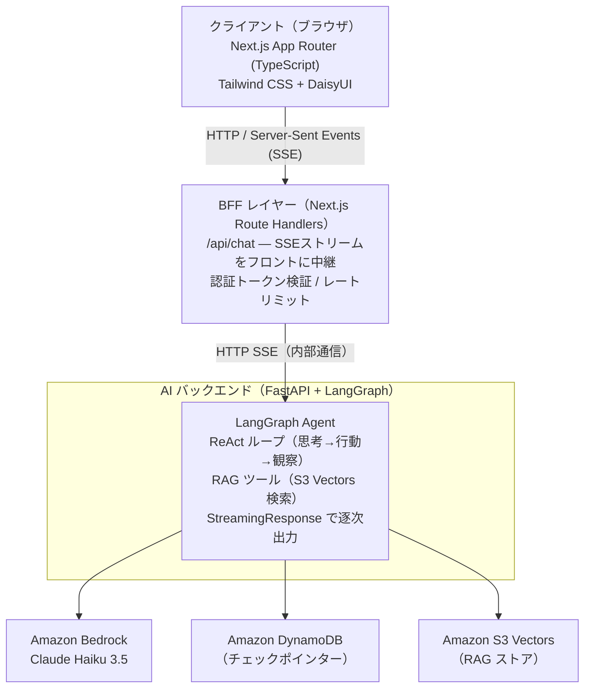

# システム全体構成

## アーキテクチャ概要

本アプリは **Next.js BFF（Backend for Frontend）** と **Python FastAPI バックエンド** を組み合わせたハイブリッド構成です。フロントエンドは Vercel（または AWS Amplify）にデプロイし、AIバックエンドは AWS Lambda 上でサーバーレス運用します。

## 構成図



## データフロー詳細

### 1. チャットリクエスト（SSE ストリーミング）

```
1. ユーザーがメッセージ送信
2. Next.js クライアント: POST /api/chat
3. Route Handler: Python API へ SSE リクエストを転送
4. FastAPI: LangGraph エージェントを起動
5. エージェント: Bedrock Haiku 3.5 へ推論リクエスト
6. レスポンス: SSE チャンクを逐次クライアントへストリーム
7. フロントエンド: DaisyUI chat-bubble にトークンを追記
```

### 2. 会話状態の永続化

```
1. LangGraph: 各ステップで DynamoDB にチェックポイント保存
2. 状態サイズが 350KB 超: S3 にオフロード、DynamoDB には S3 URI のみ保持
3. 次回会話: session_id からDynamoDB を引いて状態復元
```

### 3. RAG 検索フロー

```
1. エージェントが RAG ツールを呼び出し
2. クエリを Bedrock Embeddings でベクトル化
3. S3 Vectors で類似度検索
4. 上位 K 件のチャンクを LLM コンテキストに注入
```

詳細は [`rag-pipeline.md`](rag-pipeline.md) を参照。

## デプロイ構成

| コンポーネント | ホスティング | 理由 |
|-------------|------------|------|
| Next.js フロントエンド | Vercel / AWS Amplify | ゼロコンフィグ、エッジキャッシュ |
| FastAPI バックエンド | AWS Lambda (LWA) | リクエスト課金、常時起動不要 |
| DynamoDB | AWS フルマネージド | 自動スケール、サーバーレス親和 |
| S3 Vectors | AWS フルマネージド | 低コスト、マネージドベクトル検索 |

## 関連ドキュメント

- [RAG パイプライン設計](rag-pipeline.md)
- [ストリーミング仕様](../api/streaming-spec.md)
- [AWS リソース設計](../infrastructure/aws-resources.md)
- [UI 設計](../frontend/ui-design.md)
